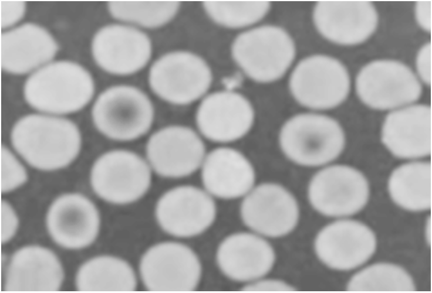
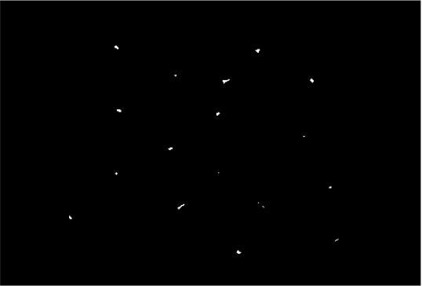
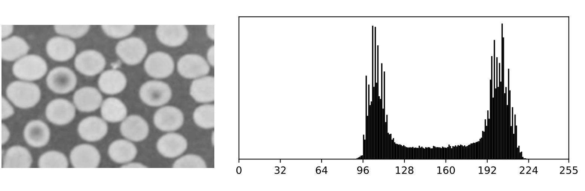

  

# Cell Counter Project

The codes provided allow you to process a pgm scanner image in order to count the number of cells present on it.

The data structures used are contiguously allocated arrays. This allows me, when reading or writing a file, to work with all the data at once, treating it as a single binary block. 

For thresholding, I used the Otsu method. It allows me to automatically determine the threshold value from the image histogram, the one that maximizes the inter-class variance.

I'm also going to apply basic morphological operations (Erosion, Dilatation, Reconstruction) to remove cells from the edge of my image considered spurious, plug holes in my cells, erode the image to separate cells in contact.

To count cells, I've considered that two pixels belong to the same connected component if they are in contact on one of their four sides.

For this project, I'm programming in C and using Valgrind to perform tests and memory analysis, with a view to detecting performance problems or program instability.
program performance or instability problems.\

### Otsu's Method

**Figure 1 – The image and its histogram.**

The Otsu method lists all possible threshold values, from 0 to 255, and finds the one that maximizes the inter-class variance, i.e. the one that best separates the two modes. The inter-class variance \( $\sigma_b^2(s)$ \) is defined in equation (1).

$$
\sigma_b^2(s) = \omega_0(s)\omega_1(s)[\mu_0(s) - \mu_1(s)]^2 \tag{1}
$$

where $\omega_0(s)$ and $\omega_1(s)$ are the class probabilities, defined in equation (2)

$$
\omega_0(s) = \sum_{i=0}^{s-1} h(i) \quad \text{et} \quad \omega_1(s) = \sum_{i=s}^{255} h(i) \tag{2}
$$

and $\mu_0(s)$ and $\mu_1(s)$ are the empirical class means defined in equation (3).

$$
\mu_0(s) = \frac{\sum_{i=0}^{s-1} ih(i)}{\omega_0(s)} \quad \text{et} \quad \mu_1(s) = \frac{\sum_{i=s}^{255} ih(i)}{\omega_1(s)} \tag{3}
$$

The threshold calculated is the value of s for which the inter-class variance of $sigma_b^2(s)$ is at its maximum.

